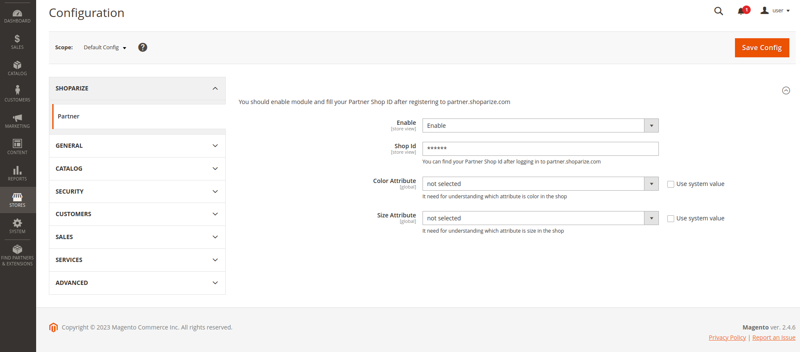
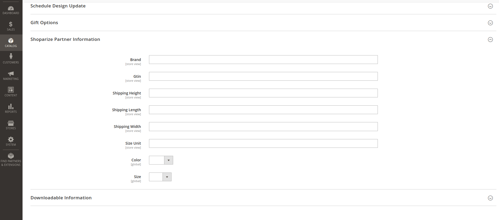

## Shoparize Partner Magento Extension

### for install need to execute:

```shell
cd /to/magento/shop/;

# install repositories(need to get access)
composer config repositories.shoparize_product_api vcs git@github.com:shoparize/partner-plugin-product-api.git;
composer config repositories.shoparize_magento vcs git@github.com:shoparize/magento-partner.git;

# install magento extension
composer require shoparize/magento-partner:"^1.0";

bin/magento module:enable Shparize_Partner;
bin/magento setup:upgrade;
bin/magento setup:di:compile;
bin/magento cache:flush;
```
after installing config page will be available



Field of Color Attribute, Size Attribute need to set up using current color, size attributes. If the color, size attributes does not exist at a shop they will be installed in time installing the module.



### Send request to product api

example of request:
```http request
GET http://localhost/shoparize-partner/products?page=1&limit=3&updated_after=2023-08-13T16:05:53+03:00
Shoparize-Partner-Key: 999999
```
response:
```json
{
  "items": [
    {
      "id": "1",
      "title": "Joust Duffle Bag",
      "description": "The sporty Joust Duffle Bag can't be beat - not in the gym, not on the luggage carousel, not anywhere. Big enough to haul a basketball or soccer ball and some sneakers with plenty of room to spare, it's ideal for athletes with places to go.\r\n\r\nDual top handles.\r\nAdjustable shoulder strap.\r\nFull-length zipper.\r\nL 29\" x W 13\" x H 11\".\r\n",
      "link": "http:\/\/localhost\/joust-duffle-bag.html",
      "images": [
        "http:\/\/localhost\/media\/catalog\/product\/m\/b\/mb01-blue-0.jpg"
      ],
      "mobile_link": "http:\/\/localhost\/joust-duffle-bag.html",
      "availability": "out_of_stock",
      "price": "34.00",
      "brand": null,
      "gtin": null,
      "condition": "new",
      "currency_code": "USD",
      "shipping_length": null,
      "shipping_width": null,
      "shipping_height": null,
      "shipping_weight": "11.000000",
      "size_unit": null,
      "sale_price": "34.00",
      "colors": [
        "Black"
      ],
      "sizes": null,
      "shipping": {
        "country": "US",
        "service": "Best Way",
        "price": "0.00"
      },
      "weight_unit": "lbs"
    },
    {
      "id": "2",
      "title": "Strive Shoulder Pack",
      "description": "&lt;p&gt;Convenience is next to nothing when your day is crammed with action. So whether you're heading to class, gym, or the unbeaten path, make sure you've got your Strive Shoulder Pack stuffed with all your essentials, and extras as well.&lt;\/p&gt;\r\n&lt;ul&gt;\r\n&lt;li&gt;Zippered main compartment.&lt;\/li&gt;\r\n&lt;li&gt;Front zippered pocket.&lt;\/li&gt;\r\n&lt;li&gt;Side mesh pocket.&lt;\/li&gt;\r\n&lt;li&gt;Cell phone pocket on strap.&lt;\/li&gt;\r\n&lt;li&gt;Adjustable shoulder strap and top carry handle.&lt;\/li&gt;\r\n&lt;\/ul&gt;",
      "link": "http:\/\/localhost\/strive-shoulder-pack.html",
      "images": [
        "http:\/\/localhost\/media\/catalog\/product\/m\/b\/mb04-black-0.jpg",
        "http:\/\/localhost\/media\/catalog\/product\/m\/b\/mb04-black-0_alt1.jpg"
      ],
      "mobile_link": "http:\/\/localhost\/strive-shoulder-pack.html",
      "availability": "in_stock",
      "price": "35.00",
      "brand": "Brand Name",
      "gtin": "123123123",
      "condition": "new",
      "currency_code": "USD",
      "shipping_length": null,
      "shipping_width": null,
      "shipping_height": null,
      "shipping_weight": "5.000000",
      "size_unit": "111111",
      "sale_price": "35.00",
      "colors": [
        "Black",
        "Gray",
        "Multi",
        "Red"
      ],
      "sizes": [
        false
      ],
      "shipping": {
        "country": "US",
        "service": "Best Way",
        "price": "0.00"
      },
      "weight_unit": "lbs"
    }
  ]
}
```
